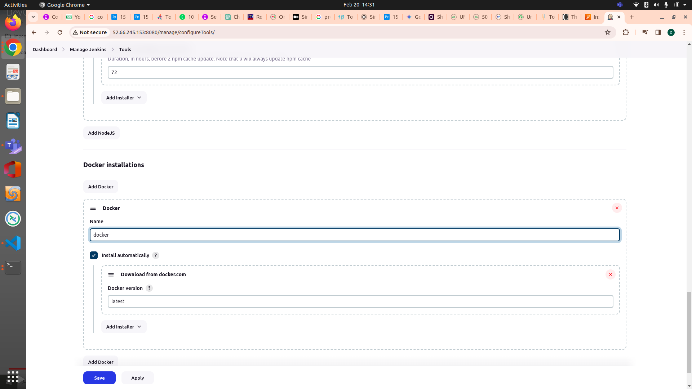

# CI/CD PIPELINE VERIFICATION FOR REDDIT CLONE PROJECT

## Project Description:
This project involves setting up an infrastructure using Terraform to provision an EC2 instance for Jenkins, Docker, and SonarQube, along with configuring Kubernetes monitoring using Helm, Prometheus, and Grafana. Additionally, ArgoCD is installed on a Kubernetes cluster to manage deployments, and a CI/CD pipeline is verified for a GitHub repository.

## Prerequisites:
* An AWS account with appropriate permissions.
* Basic understanding of cloud infrastructure, Docker, Jenkins, SonarQube, ArgoCD, and Terraform.
## Workflow
**1. Terraform Configuration**
 * EC2 Instance Setup
		The main.tf in the Terraform folder contains the terraform code to set up the EC2 instance named"Jenkins-SonarQube" as well Security Group named "Jenkins-VM-SG" and will run a script named install.sh in the created instance. 
 * Script for EC2 User Data
		The install.sh the Terraform folder contains a shell script which install Jenkins, Docker,trivy and run SonarQube as container.
 * Execution Commands
	  > terraform init

	  > terraform plan

	  > terraform apply -auto-approve

**2. Jenkins Configuration and Create CI job**
*  Take the public ip of instance and place it with :8080 in a web browser and connect to the instance and run the following command to get the initial password


    > cat /var/lib/jenkins/initialpassword

* Install the suggested plugins and create a user and assign a password
	* Go to Manage Jenkins > Plugins and install all the Plugins mentioned in the image.
			
	* After install Manage Jenkins > Tools and configure
		* **NodeJs installations**
			
		* **Jdk installations**
			
		* **Docker installations**
			
		* **SonarQube Scanner installations**
			
	* Manage Jenkins > Credentials > Systems > Global credentials 
		 Create Credentials for SonarQube-Token ,github ,dockerhub and JENKINS_API_TOKEN
	* New Item > PIPELINE(name the pipeline REDDIT-CLONE-CI) and select PIPELINE script from scm and give the repository URL
		 
		 
**3. Setting Up AWS EKS Cluster**
* Install kubectl
```
$ sudo apt update
$ sudo apt install curl
$ curl -LO https://dl.k8s.io/release/$(curl -L -s https://dl.k8s.io/release/stable.txt)/bin/linux/amd64/kubectl
$ sudo install -o root -g root -m 0755 kubectl /usr/local/bin/kubectl
$ kubectl version --client
```
			 
* InstallAWS CLI
```
$ curl "https://awscli.amazonaws.com/awscli-exe-linux-x86_64.zip" -o "awscliv2.zip"
$ sudo apt install unzip
$ unzip awscliv2.zip
$ sudo ./aws/install
$ aws --version
```
* Installeksctl
```
$ curl --silent --location "https://github.com/weaveworks/eksctl/releases/latest/download/eksctl_$(uname -s)_amd64.tar.gz" | tar xz -C /tmp
$ cd /tmp
$ sudo mv /tmp/eksctl /bin
$ eksctl version
```		 
* Setup Kubernetes using eksctl
```	 
eksctl create cluster --name virtualtechbox-cluster \
--region ap-south-1 \
--node-type t2.small \
--nodes 3 \
```			
* Verify Cluster with below command
```
$ kubectl get nodes
```		 
**4. Setup Monitoring for Kubernetes using Helm, Prometheus and Grafana Dashboard**	
* Install Helm Chart
```
$ curl -fsSL -o get_helm.sh https://raw.githubusercontent.com/helm/helm/master/scripts/get-helm-3
$ chmod 700 get_helm.sh
$ ./get_helm.sh
$ helm version
```
* Add Helm repositories for stable and Prometheus.
```
$ helm repo add stable https://charts.helm.sh/stable                    
$ helm repo add prometheus-community https://prometheus-community.github.io/helm-charts
```
* Create a namespace for Prometheus.
```
$ kubectl create namespace prometheus
```
* Install Prometheus using Helm.
```
$ helm install stable prometheus-community/kube-prometheus-stack -n prometheus
```
* Check Prometheus installation status.
```
$ kubectl get pods -n prometheus
$ kubectl get svc -n prometheus
```
* Expose Prometheus and Grafana to the external world.
	* change it from Cluster IP to LoadBalancer.change port & targetport to 9090,  save and close
		> $ kubectl edit svc stable-kube-prometheus-sta-prometheus -n prometheus
	* copy dns name of LB and browse with 9090
		>	$ kubectl get svc -n prometheus
	* change it from Cluster IP to LoadBalancer
		>	$ kubectl edit svc stable-grafana -n prometheus
	* copy dns name of LB and browse
		>	$ kubectl get svc -n prometheus
	* use this command to get the password. the user name is admin
		>	$ kubectl get secret --namespace prometheus stable-grafana -o jsonpath="{.data.admin-password}" | base64 --decode ; echo
* Access Grafana and Prometheus dashboards.
	* Import required dashboards for monitoring.
		*	Import dashboard - 15760 - Load - Select Prometheus  & Click Import. 
		*	Import dashboard - 12740 - Load - Select Prometheus  & Click Import. 
			
**5. ArgoCD Installation on Kubernetes Cluster and Add EKS Cluster to ArgoCD**
* First, create a namespace
	>$ kubectl create namespace argocd

* Next, let's apply the yaml configuration files for ArgoCd
	>$ kubectl apply -n argocd -f https://raw.githubusercontent.com/argoproj/argo-cd/stable/manifests/install.yaml

* Now we can view the pods created in the ArgoCD namespace.
	>$ kubectl get pods -n argocd

* To interact with the API Server we need to deploy the CLI:
	>$ sudo curl --silent --location -o /usr/local/bin/argocd https://github.com/argoproj/argo-cd/releases/download/v2.4.7/argocd-linux-amd64

	>$ sudo chmod +x /usr/local/bin/argocd
      
* Expose argocd-server
	>$ kubectl patch svc argocd-server -n argocd -p '{"spec": {"type": "LoadBalancer"}}'

* Wait about 2 minutes for the LoadBalancer creation
	>$ kubectl get svc -n argocd

* Get pasword and decode it and login to ArgoCD on Browser. Go to user info and change the password
	>$ kubectl get secret argocd-initial-admin-secret -n argocd -o yaml

	>$ echo WXVpLUg2LWxoWjRkSHFmSA== | base64 --decode

* login to ArgoCD from CLI
	>$ argocd login a2255bb2bb33f438d9addf8840d294c5-785887595.ap-south-1.elb.ama zonaws.com --username admin,    provide the password which you set above

* Check available clusters in ArgoCD
	>$ argocd cluster list

* Below command will show the EKS cluster details
	>$ kubectl config get-contexts

* Add above EKS cluster to ArgoCD with below command
	>$ argocd cluster add i-08b9d0ff0409f48e7@virtualtechbox-cluster.ap-south-1.eksctl.io --name virtualtechbox-eks-cluster
     
* Now if you give command "$ argocd cluster list" you will get both the clusters EKS & AgoCD(in-cluster). This can be verified at ArgoCD Dashboard.	
